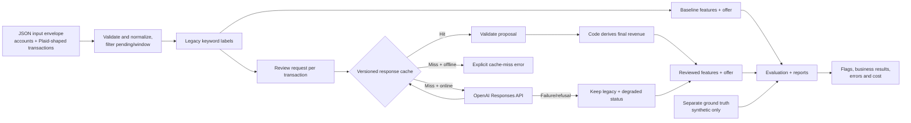

# Fundo Transaction Reviewer — v1 Architecture

> **Status:** proposed v1 design; implementation and results are pending. [CHALLENGE.md](CHALLENGE.md) is the source of truth. Approved project choices are in [BUSINESS_RULES.md](BUSINESS_RULES.md) and [DEVELOPMENT_RULES.md](DEVELOPMENT_RULES.md); [IMPLEMENTATION_CHECKLIST.md](IMPLEMENTATION_CHECKLIST.md) tracks implementation evidence. This document defines components and flow, not measured performance or a production deployment.

## 1. V1 scope and acceptance contract

V1 is one **modular Python batch pipeline** behind a CLI. It accepts seeded, Plaid-shaped synthetic data or a new transaction file; labels transactions with a deliberately imperfect legacy keyword engine; asks an LLM to **review those labels**; and compares credit features and offers. It is a reproducible take-home demonstration, **not** an automated funding-decision service.

| Challenge area | V1 must deliver | Evidence of completion |
| --- | --- | --- |
| Data and legacy engine | About 10 synthetic businesses, approximately 90 days and a couple thousand Plaid-shaped transactions; 13 keyword groups plus business/personal and revenue labels. | Seeded dataset, separate truth, ruleset and deterministic tests. |
| LLM reviewer | Review **each** legacy label; flag doubts with corrected group, business/personal, code-derived revenue, confidence and a short reason. | Transaction-level flags, hard-negative/error review, safe handling of untrusted descriptions and invalid/provider responses. |
| Credit impact | Compare legacy, reviewed and truth-derived per-business features and offers; test 2%, 5% and 10% mislabel scenarios. | Dollar revenue error, NSF/overdraft counts, high-risk debit share, revenue/deposits, offer deltas and sensitivity reports. |
| Delivery | Run from a clean checkout with one documented command, replay committed LLM responses without an API key, and remain under US$10 of live LLM spend. | CLI integration test, locked dependencies, committed cache, usage/cost report, `README.md` and `SOLUTION.md`. |
| Production design | Explain shadow rollout, quality gate, feature drift, historical decision replay and underwriter feedback. | One-page design in `SOLUTION.md`; **no** production service in v1. |

**Not in v1:** frontend, HTTP backend, database, cloud deployment, real customer data, retrained risk model, or an agent/workflow framework. These add complexity without satisfying a required deliverable.

## 2. System data flow

Ground truth is **never passed to the reviewer**. A new file without truth can produce flags and before/after features through online review (or if its exact requests are already cached), but cannot claim measured accuracy. An uncached offline input fails visibly; an online provider failure records degraded review and preserves the legacy label. These are distinct outcomes.

## 3. Data contracts and ownership

| Contract | Fields and invariants | Owner |
| --- | --- | --- |
| Transaction | Stable transaction/account IDs, date, `amount`, `name`, optional `merchant_name`, pending status and available Plaid category fields; the input envelope maps accounts to businesses and coverage. In Plaid Transactions, **negative = money in; positive = money out**. Preserve the raw record and use a normalized view for rules. | Input module |
| Legacy label | One winning group or explicit `unmatched`, business/personal, derived revenue, matched rule IDs and ruleset version. All 13 named groups remain representable. | Keyword engine + deterministic revenue rule |
| Review proposal | Transaction ID, keep/change, proposed group and business/personal, confidence and brief reason. The model cannot edit source transactions or supply authoritative revenue. | LLM; then schema and semantic validation in code |
| Final label | Validated proposal or unchanged legacy label, revenue **recomputed in code**, and provenance (`cache`, `online`, `provider_failure`, etc.). | Review orchestrator |
| Truth label | Separate, ID-keyed reference for synthetic evaluation only; excluded from model input and cache keys. | Data generator / evaluation fixture |
| Credit result | Per-business window coverage, deposit and revenue totals, AMR, NSF/overdraft counts, daily funder payments, high-risk debit share and offer. | Credit module |

Reject missing/duplicate IDs, malformed dates or amounts, and unsupported files rather than silently guessing. Approved pending/posted, date-window, currency and short-history policies are in [BUSINESS_RULES.md](BUSINESS_RULES.md); they still need implementation tests. Use integer cents or `Decimal` for money, never binary floating-point for offer arithmetic.

## 4. Modules and pipeline

| Location | Responsibility |
| --- | --- |
| `src/fundo_reviewer/cli.py` | Single entry point; chooses offline replay or online cache-fill, input/output paths and run manifest. |
| `src/fundo_reviewer/data.py` | Seeded synthetic generation and Plaid-shaped input validation/normalization. Truth is written separately. |
| `src/fundo_reviewer/legacy.py` | Versioned keyword lists, matching and precedence, business/personal flag, matched-rule trace. |
| `src/fundo_reviewer/revenue.py` | One authoritative revenue-eligibility function used by legacy, reviewed and truth calculations. |
| `src/fundo_reviewer/reviewer.py` | Prompt construction, one review decision per transaction, response schema, validation and fallback. Descriptions are **untrusted data**. |
| `src/fundo_reviewer/cache.py` | Canonical request hash, committed response read/write, integrity checks and usage metadata. |
| `src/fundo_reviewer/credit.py` | Per-business features and deterministic offer rule; same functions before and after review. |
| `src/fundo_reviewer/evaluation.py` | Truth comparison, dollar revenue error, hard-negative false flags, sampled 2%/5%/10% mislabel sensitivity and concrete error cases. |
| `src/fundo_reviewer/reporting.py` | Stable, underwriter-readable flags and machine-readable per-business artifacts. |
| `tests/` | Unit, adversarial and end-to-end replay tests. |

These are **responsibility boundaries**, not a mandate for one file per row. Keep code small enough to explain and modify live. The generator should create a deterministic mix of normal and adversarial cases: processor versus funder, noisy descriptions, punctuation misses, hard negatives, no-fee NSF bank and 61-day coverage. A separate truth file quantifies errors without leaking answers to the reviewer.

## 5. Technology choices

- **Runtime and files:** Python 3.12+, `uv` with committed `pyproject.toml` / `uv.lock`, and standard-library `argparse`, JSON, `datetime`, `hashlib`, logging and `Decimal`. Prefer plain files over pandas or a database at this scale. A one-command CLI entry point will be added with the implementation; Docker is unnecessary for this local batch pipeline.
- **Provider integration:** Official OpenAI Python SDK, **Responses API**, and Pydantic Structured Outputs. Start experiments with configurable `gpt-6-luna` because the task is repetitive and spend is capped; promote it only if measured review quality is adequate. Pin dependencies and record the exact model identifier, prompt and schema versions in every run. [OpenAI model documentation](https://developers.openai.com/api/docs/models/gpt-6-luna), [Structured Outputs documentation](https://developers.openai.com/api/docs/guides/structured-outputs).
- **Tests:** `pytest` for fast unit and CLI integration tests. No Plaid API/Sandbox dependency: Plaid defines the input contract; seeded synthetic data is the default. [Plaid Transactions documentation](https://plaid.com/docs/api/products/transactions/).
- **Storage:** Repository-local `data/transactions/`, `data/ground_truth/`, `cache/` and generated `reports/`. Commit synthetic fixtures and LLM response cache; keep secrets out of Git.

## 6. Rules, model boundary and failure policy

**Code owns** sign interpretation, input validity, keyword precedence, revenue exclusions, feature denominators, window normalization, offer arithmetic, cache keys and reporting. **The LLM only judges whether the existing semantic label and business/personal flag should change**, with confidence and a concise reason. Code checks allowed groups, ID alignment, confidence range and keep/change consistency, then derives revenue from the final label and transaction direction. Invalid, refused, incomplete or unavailable online responses retain the legacy label and surface a failure status; they never become silent approvals.

Treat all bank description fields as counterparty-controlled, untrusted text. Delimit them as data in the prompt; do not execute instructions found there. Structured output reduces shape errors but does not replace validation. Bound retries and enforce the approved **$8 operating ceiling and hard stop below US$10**; report actual usage/cost separately from estimates. Do not claim a model is good enough until measured against held-out truth cases; no confidence threshold suppresses valid change flags in v1.

Keyword lists, precedence, revenue exclusions, pending/duplicate policy, funder-payment estimator, high-risk denominator, negative-offer floor and flag policy are **approved v1 choices** documented in [BUSINESS_RULES.md](BUSINESS_RULES.md). Version and test each; never imply Fundo supplied them.

## 7. Reproducibility, tests and outputs

The cache key hashes a canonical review request: normalized fields visible to the reviewer, legacy label, model identifier, prompt version and response schema version. Store the raw response, parsed proposal, usage and status. Changed prompt, model, rules-derived label or relevant transaction field causes a miss rather than stale reuse. In **offline mode**, no SDK call or API key is needed; missing/corrupt entries fail visibly. In **online mode**, calls only fill misses and cannot exceed the budget guard. Reports use stable ordering and record a run manifest with data/rules/model/prompt/schema/offer versions and input hashes.

Minimum test matrix:

1. Plaid sign direction, revenue exclusions, group precedence, punctuation misses and processor-versus-funder collisions.
2. Pending/posted duplication, hard negatives, untrusted description text, invalid/refused model output and provider outage.
3. Cache replay without a key, cache invalidation after version/input changes, budget guard and deterministic output hashes.
4. Offer math at **NSF = 5 versus 6**, false revenue versus false active-advance direction, negative offers, 61-day coverage and sensitivity sampling.
5. End-to-end CLI on committed synthetic data **and** a small new Plaid-shaped fixture without a truth file.

`reports/` should contain transaction flags, per-business legacy/reviewed/truth metrics, offer deltas, hard-negative and error examples, sensitivity results, and LLM usage/cost. `README.md` supplies copy-paste commands for clean checkout and cache-only replay. `SOLUTION.md` contains measured results, limitations, model/code boundary, the two risk-model blind-spot answers, production design and AI-tool disclosure.

## 8. Production controls (design only)

Run the reviewer in **shadow** beside the existing keyword engine, compare dollar revenue error and unnecessary flags, then gate any live label changes on evidence and underwriter review. Monitor input-window coverage and distributions of labels, features and offers by rules/model version to catch upstream drift. Preserve each decision's transaction snapshot, labels, versions, features, offer and human action so a later keyword fix cannot rewrite its history. Feed underwriter corrections into a versioned evaluation set before changing rules or prompts. No production service is built in this take-home.
